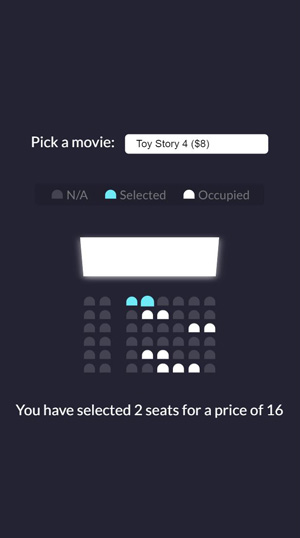

# Movie Seat Booking App

This small movie booking which build with Vanilla JavaScript focuses on mastery DOM manipulation and building UI.

With the App a user can pick seats and select a movie. Each movie has a different price. You receive a text message with total number on selected seats and total price for the selected movie.

## How to Run the App

To install the app, clone or download a local copy of the app and simply open the index.html from any web browser.

As an alternative, the app can be viewed on the live version: [Movie Seat Booking]()

## Credits

- The movie seats booking app is a part of

[JavaScrpit course](https://www.udemy.com/course/web-projects-with-vanilla-javascript)
